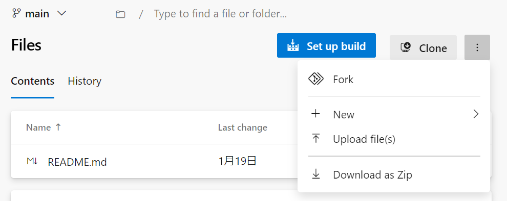
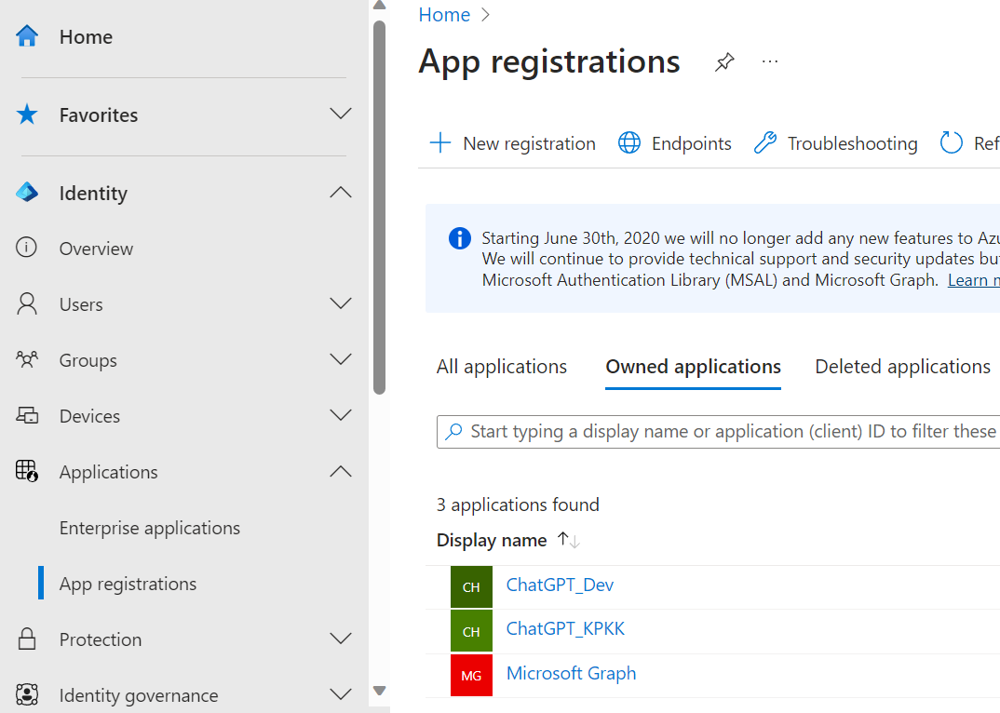
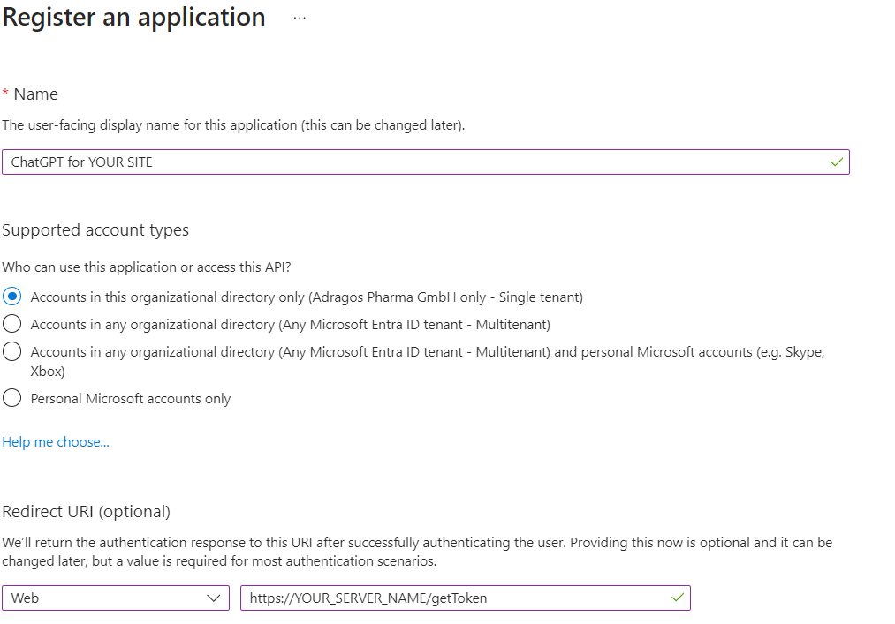
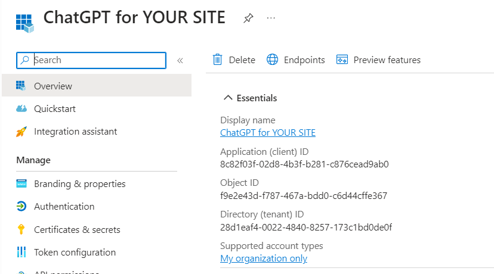
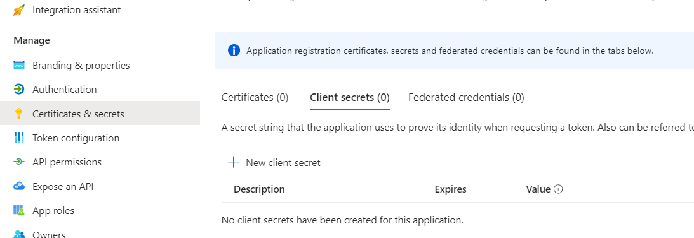
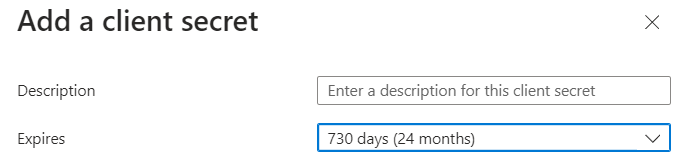
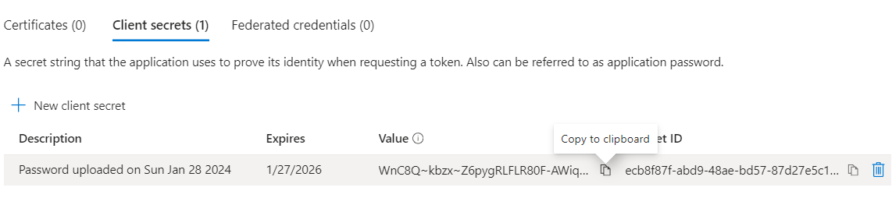

# ChatGPT_Deployment

## How to deploy this app

An outlne for the deployment is as follows.
The details for each item follows this section.
1. Clone this project into the server
2. Register this app to Microsoft Entra Admin Center.
3. Create SSL certificate.
4. Place SSL certificate in web/prod_certs folder and replace the environmental variables in app/Dockerfile.
5. Install Docker
6. launch docker and run docker compose up -d command.

## 1. Clone This Project

This project is placed in the below repository.
https://dev.azure.com/AdragosPharma/Data_Landscape_Prototype_Dev/_git/ChatGPT

You need to clone this repository into your server.
Cloning the repository can be done through some methods.
Maybe downloading as ZIP is the most easy way.


You can access this repository using ssh.
Using ssh is useful when you apply updates in the future.
You can do it only by one code: git pull.
You can learn how to activate ssh authentication in the below hyperlink.
https://learn.microsoft.com/en-us/azure/devops/repos/git/use-ssh-keys-to-authenticate?view=azure-devops

## 2. Register this app in Microsoft Entra Admin Center

You can access Microsoft Entra Admin Center by clicking the below hyperlink.
https://entra.microsoft.com/#home

Click Application, App registration.
Then, click + New registration.


In the Name field, enter any name you like.
In Supported account types, Accounts in this organizational directory only (Adragos Pharma GmbH only - Single tenant) should be selected.
Redirected URI, enter "https://YOUR_SERVER_HOSTNAME/getToken".
** You need to replace YOUR_SERVER_HOSTNAME with the your actual server hostname. The hostname must be registered in your DNS server.
** You need to write the redirected URI you write here in environmental variables, Dockerfile.
Then, click register.


In overview, you can find Application (client) ID and Directory (Tenant) ID. These will be used in Dockerfile.


Click Certificates & secrets, click client secrets.
Then, click + new client secret.


Description can be empty.
For expires, maybe select the longest term would be good idea. You can select any term, but once it expires, you need to re-create the secret.
Then, click Add.


Be sure to make a copy of Value in this page.
You will use this value as client_secret in Dockerfile.
Once you leave this page, the Value will be hidden and you cannot see it again.


## 3. Create SSL Certificate

If you have a certificate authority, please use it.
If you don't have, you will need to create self-signed certificate and distribute it to all your cleint PCs in your site.

The following is the way to create self-signed certificate.
If you have CA, please skip this section and create the SSL certificate using your CA.

Install openssl on your server.
If you use Windows, you can download it from the below hyperlink.
Light version is enough to use.
https://slproweb.com/products/Win32OpenSSL.html

Create private key. The command is as follows.
The key will be created in the current directory for your terminal or command prompt.
Before executing the commands, I recommend to change the current directory to web/prod_certs in this repository.
The current directory can be changed by cd PATH command.

```
openssl genrsa -out private-key.pem 4096
```

Create a certificate sign request.
You will be asked about the server information.
Enter your server FQDN in Common Name.
Other information is not so important.

```
openssl req -new -key private-key.pem -out request.csr
```

Create self-signed key.
If you have CA, please sign the request with your CA.
If not, you will sign the request with the private key of the server.
The command is as follows.

```
openssl x509 -signkey private-key.pem -in request.csr -req -days 3650 -out public-key.pem
```

## 4. Place SSL certificate and replace environmental variables

The self-signed certificate and private key should be stored in web/prod_certs of this repository.
The name of self-signed certificate should be public-key.pem.
The name of private key should be private-key.pem.

Then, you need to modify the environmental variables written in app/Dockerfile of this repository.
The information of the application registered in Entra Admin Center will be used.
The environmental variables you need to change are written below the line of FROM base AS PROD.
You don't have to edit above it.

The part you need to edit is part with upper letters (except ENV) in the below examples.
```
ENV client_secret=VALUE_OF_CLIENT_SECRET 
ENV client_id=APPLICATION_(CLIENT)_ID
ENV tenant_id=DIRECTORY_(TENANT)_IT
ENV redirect_url=REDIRECT_URI
```

## 5. Install Docker

You can download Docker from docker website.
If you don't have an account, please create one.
https://www.docker.com/

Once login, you can find the download page.


** If you use a virtual machine as your server, there's possibility that you cannot install docker desktop. In this case, please install only docker engine.
For Ubuntu, Docker Engine can be installed by running the following commands.
For a virtual machine of Windows server, I don't know how to install docker. 
It might not be compatible with windows server...
```
sudo apt-get update
sudo apt-get install apt-transport-https ca-certificates curl gnupg lsb-release
curl -fsSL https://download.docker.com/linux/ubuntu/gpg | sudo gpg --dearmor -o /usr/share/keyrings/docker-archive-keyring.gpg
echo \
"deb [arch=$(dpkg --print-architecture) signed-by=/usr/share/keyrings/docker-archive-keyring.gpg] https://download.docker.com/linux/ubuntu \
$(lsb_release -cs) stable" | sudo tee /etc/apt/sources.list.d/docker.list > /dev/null
sudo apt-get update
sudo apt-get install docker-ce docker-ce-cli containerd.io
```

## 6. launch docker and run docker compose up -d command.

After docker is installed, run docker desktop.
If windows, you need to run as Administrator to open docker desktop.

Once docker is launched, open the terminal (for windows, open as Administrator).
Next, change the current directory to this repository.
Then, run the following command.

```
docker compose up -d
```

If everything is appropriately installed, the container will be created and run the ChatGPT app.
If you launch the container for the first time, it will take several minutes to complete.
But, it will take only several seconds next time.
You can access your ChatGPT via https://YOUR_SERVER_HOSTNAME
